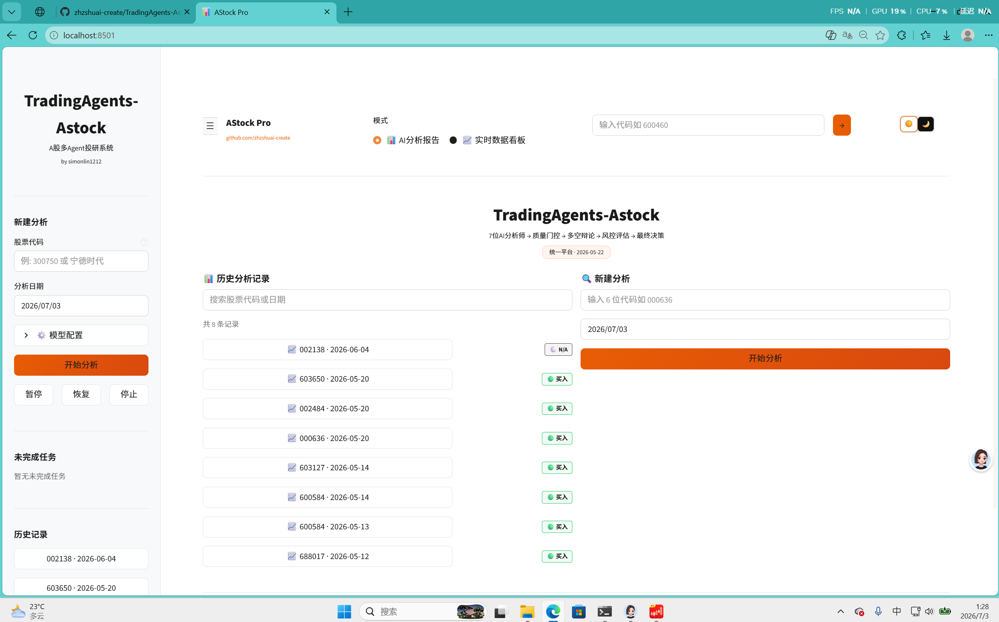

# AStock Pro

AI 多智能体 A 股投资研究平台，集成实时数据看板。基于 [TradingAgents](https://github.com/TauricResearch/TradingAgents) 框架的深度定制版。

> ⚠️ 仅供学习研究，不构成投资建议。

---

## 📸 界面预览

### AI 分析报告模式

7 个 AI 分析师并行采集数据 → 多空辩论 → 风控评估 → 最终投资决策。

<p align="center">
  
</p>

### 实时数据看板（暗色模式）

K 线（分时/5日/30日/全部）· 实时估值指标 · 概念板块 · 强势股列表。

<p align="center">
  
</p>

### 实时数据看板（亮色模式）

同一看板在亮色主题下的展示效果。

<p align="center">
  
</p>

### 分析进度

12 阶段 pipeline 实时进度，7 分析师报告可展开查看，支持暂停/继续/停止。

<p align="center">
  
</p>

### 完整报告导出

信号卡片（Buy/Hold/Sell）+ 7 份分析师报告 + 多空辩论 + 风控评估，支持 PDF / Markdown 下载。

<p align="center">
  
</p>

### K 线周期对比

同一股票不同时间周期（分时/5日/30日/全部）的 K 线切换对比。

<p align="center">
  
</p>

---

## 功能特性

| 功能 | 说明 |
|------|------|
| 🧠 **AI 分析报告** | 7 个 AI 分析师 → Bull/Bear 辩论 → 三方风控 → 最终决策，全自动中文研报 |
| 📈 **实时数据看板** | 交互式 K 线图 · 腾讯实时行情 · 北向资金 · 概念板块归因 · 行业对比 |
| 🌓 **即时主题切换** | 亮色 / 暗色一键切换，纯 JS + CSS 零延迟，localStorage 持久化记忆 |
| 📂 **可展开侧边栏** | 顶部 ☰ 按钮控制，内含股票代码输入、LLM 模型配置、历史记录 |
| 🔥 **强势股归因** | 同花顺当日强势股 + 题材标签（AI 算力 / 低空经济 / MLCC…） |
| ⏸️ **分析过程可控** | 随时暂停 / 继续 / 停止，卡死自动检测告警 |
| 📥 **双格式导出** | Markdown（零依赖）和 PDF 中文完整报告，跨平台字体适配 |
| 📝 **历史记录** | 自动保存所有分析，支持代码/日期搜索，一键回溯查看 |

---

## 快速开始

```bash
git clone https://github.com/zhzshuai-create/TradingAgents-Astock.git
cd TradingAgents-Astock
pip install -e .
```

创建 `.env` 配置 LLM：

```bash
DEEPSEEK_API_KEY=sk-xxx
```

启动：

```bash
streamlit run web/app.py
# 或双击桌面 AStock-UI.bat
```

浏览器访问 `http://localhost:8501`。

---

## 数据源

mootdx · 腾讯财经 · 东方财富 · 新浪财经 · 同花顺 · 财联社 · 百度股市通

全部免费直连，无需 API Key。

---

## 致谢

- [TauricResearch/TradingAgents](https://github.com/TauricResearch/TradingAgents) — 多 Agent 金融交易框架
- [simonlin1212/TradingAgents-astock](https://github.com/simonlin1212/TradingAgents-astock) — A 股数据层与特化分析师角色

## 许可证

Apache 2.0
