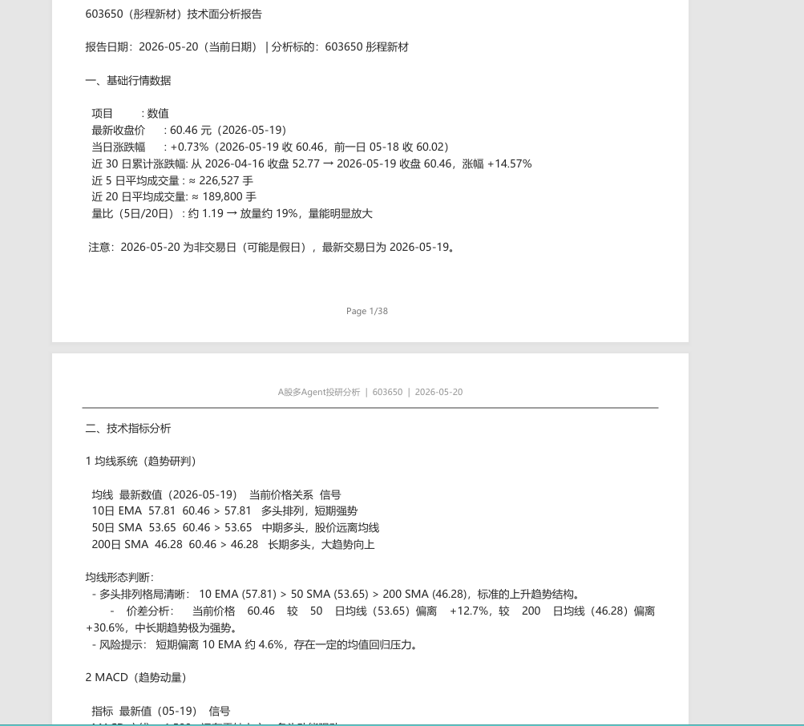
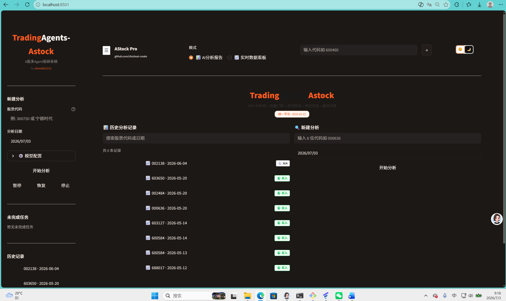
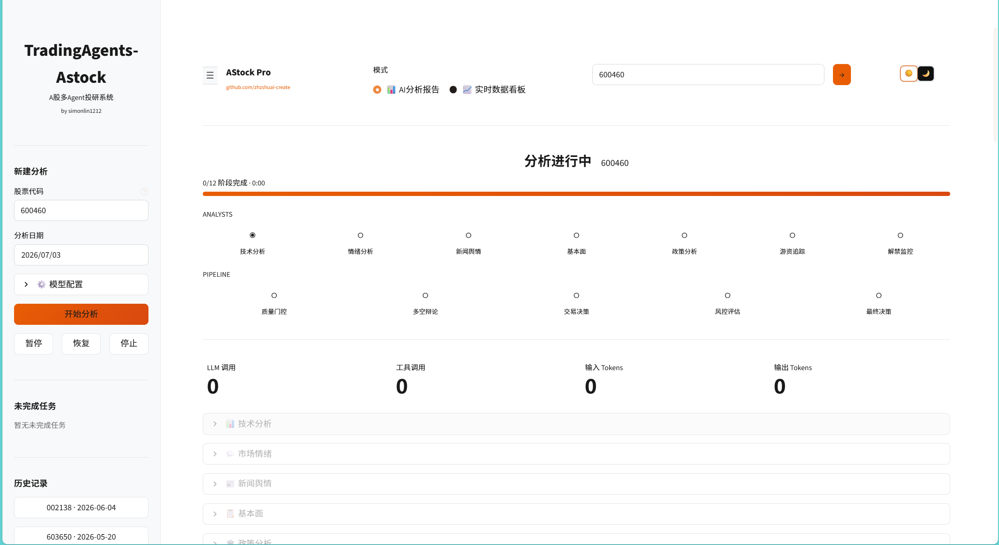
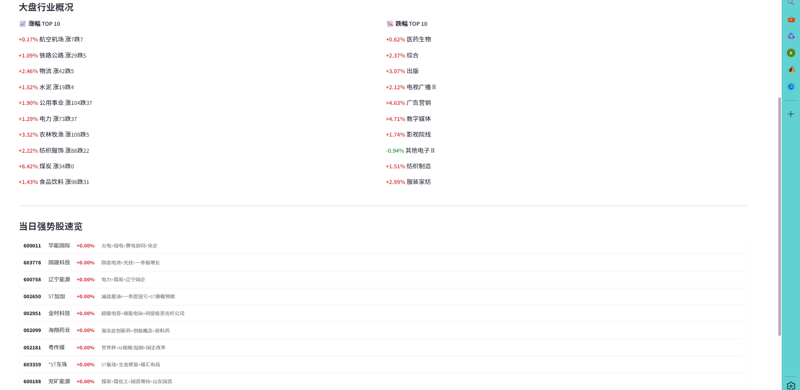
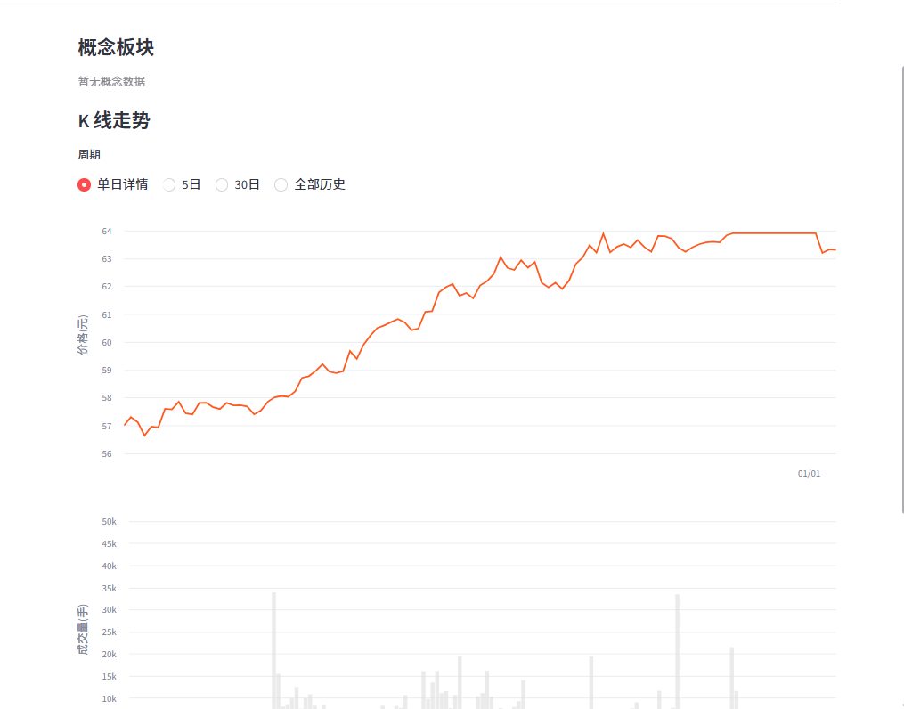
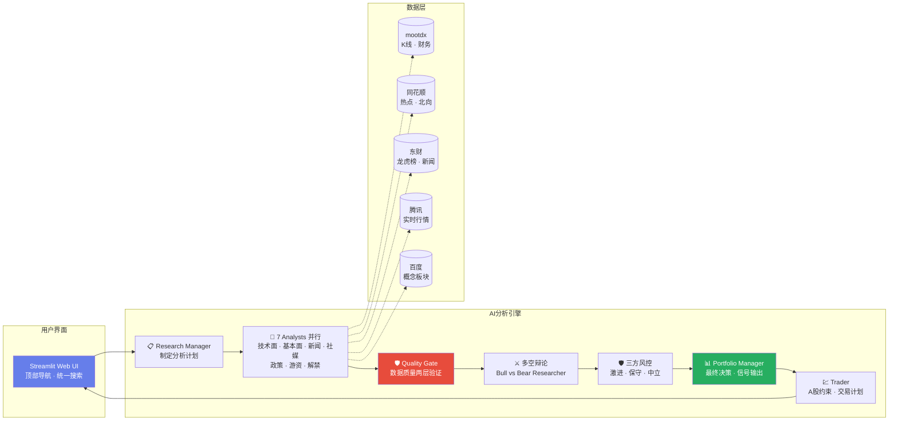

<h1 align="center">
  
  TradingAgents-Astock
</h1>

<p align="center">
  <b>🤖 A股多智能体投研系统 · 统一投资研究平台</b>
</p>

<p align="center">
  <a href="https://github.com/zhzshuai-create/TradingAgents-Astock/blob/main/LICENSE"></a>
  <a href="#"></a>
  <a href="#"></a>
  <a href="#"></a>
  <a href="#"></a>
</p>

<p align="center">
  <b>⚠️ 免责声明：本项目仅供学习研究与技术演示，不构成任何投资建议。</b>
</p>

<br>

<p align="center">
  
</p>

---

## ✨ 核心亮点

<table>
<tr>
<td width="50%">

**🔬 7 大 AI 分析师并行工作**
- 📈 技术面分析师 — K 线趋势、量价、指标
- 📊 基本面分析师 — PE/PB/PEG、一致预期、行业对比
- 📰 新闻分析师 — 公告、舆情、事件驱动
- 💬 社交媒体分析师 — 股吧/论坛情绪挖掘
- 🏛️ **政策分析师** — 监管风向、产业政策、窗口指导（🆕 新增）
- 🐲 **游资追踪师** — 龙虎榜、北向资金、大单流向（🆕 新增）
- 🔒 **解禁监控师** — 限售解禁、股东减持、股权质押（🆕 新增）

</td>
<td width="50%">

**⚔️ 多空辩论 + 三方风控**
- 🐂 多方研究员 — A股 Bull 框架（政策顺风、北向确认、游资接力）
- 🐻 空方研究员 — A股 Bear 框架（解禁压力、T+1 锁仓、估值泡沫）
- 🛡️ 三方风控辩论 — 激进/保守/中立三方博弈
- ✅ **数据质量门控** — 两层验证（硬检查 + LLM 复审）、A-F 评级
- 📋 Portfolio Manager — T+1/涨跌停/手数/A股交易约束

</td>
</tr>
</table>

### 🖥️ 统一平台：AI 分析 + 实时看板

顶部导航栏一键切换，无需多开页面：

| 模式 | 功能 |
|------|------|
| 🤖 **AI 分析报告** | 输入股票代码 → 7 分析师并行 → 多空辩论 → 生成中文研报 → PDF 下载 |
| 📊 **实时数据看板** | 4 个 Tab：个股估值 · 强势股归因 · 资金流向 · 资讯快讯 |

### 🆕 最近更新 (2026-06-04)

- **K 线周期切换** — 个股详情支持单日分时 / 5 日 / 30 日 / 全部历史四种视图，一键切换
- **强势股联动** — 强势股列表点击任意个股直接跳转行情面板，支持双向导航
- **停滞检测 + 告警** — AI 分析超过 2 分钟无进展时自动弹窗提醒，给出排查建议
- **图表自适应缩放** — 切换为 Altair 渲染，y 轴紧凑跟随价格区间，波动一目了然
- **Bug 修复** — HTTP 请求补全超时（防挂死）、Azure 客户端 base_url 修复、强势股涨跌幅清零修复

---

## 🎬 界面预览

<details open>
<summary>📸 界面截图</summary>
<br>

| AI 分析报告页 | 实时数据看板页 |
|:---:|:---:|
|  |  |

| 进度追踪 | PDF 报告 | 系统架构 |
|:---:|:---:|:---:|
|  |  |  |

| 多智能体角色 |
|:---:|
|  |
|  |
|  |
|  |

| K线周期切换 |
|:---:|
|  |

</details>

---

## 🏗️ 系统架构



---

## 🚀 快速开始

### 环境要求

- Python 3.10+
- Windows / macOS / Linux

### 安装

```bash
# 克隆仓库
git clone https://github.com/zhzshuai-create/TradingAgents-Astock.git
cd TradingAgents-Astock

# 安装依赖
pip install -r requirements.txt
```

### 配置 LLM

复制并编辑 `.env`：

```bash
cp .env.example .env
```

**推荐方案 — MiniMax**（国内直连，零代理）：
```bash
LLM_PROVIDER=minimax
LLM_QUICK_THINK_MODEL=minimax-m2.5-highspeed     # 快速推理
LLM_DEEP_THINK_MODEL=minimax-m2.7                 # 深度分析
MINIMAX_API_KEY=sk-your-minimax-key
```

**备选方案 — DeepSeek**：
```bash
LLM_PROVIDER=deepseek
LLM_QUICK_THINK_MODEL=deepseek-chat
LLM_DEEP_THINK_MODEL=deepseek-chat
DEEPSEEK_API_KEY=sk-your-deepseek-key
```

**Claude / OpenAI / Kimi / 月之暗面 / DASHSCOPE** 也全部支持，见 `.env.example`。

> 💡 **为什么推荐 MiniMax？** 国内直连、OpenAI 兼容、价格合理、高峰不限流。DeepSeek 高峰时段频繁限流，OpenAI 需要代理。

### 启动

```bash
# Web UI（推荐）
streamlit run web/app.py

# 或 CLI 模式
python cli/main.py --ticker 000858

# 或批量跑案例
python examples/run_cases.py
```

打开浏览器访问 **http://localhost:8501**

---

## 📖 使用说明

### Web UI

1. 在顶部搜索框输入股票代码（如 `600519`）或名称（如 `贵州茅台`），回车
2. 等待 7 大 AI 分析师完成数据采集与分析（约 10-15 分钟）
3. 查看多空辩论、三方风控评估、最终投资建议
4. 点击 **📥 下载 PDF** 导出完整研报

### 实时数据看板

点击顶部 **📊 数据看板** 切换到实时数据模式：

| Tab | 内容 | 数据源 |
|-----|------|--------|
| 📈 个股估值 | PE/PB/PEG/一致预期/K 线（4周期切换）/概念板块 | 腾讯 + 同花顺 |
| 🔥 强势股归因 | 当日强势股 + 题材热度排行 + **点击联动个股行情** | 同花顺热点 |
| 🔥 强势股归因 | 当日强势股 + 题材热度排行 | 同花顺热点 |
| 💰 资金流向 | 北向资金实时 + 行业排名 | 同花顺 hsgt |
| 📰 资讯 | 财联社快讯 + 个股新闻 | 东财 |

### 命令行

```bash
# 分析单只股票
python cli/main.py --ticker 300750

# 批量案例
python examples/run_cases.py
```

---

## 🧩 数据源

覆盖 **7 层数据维度**，全部免费、零门槛：

| 层级 | 数据内容 | 来源 |
|------|----------|------|
| 📈 行情 | OHLCV K线、实时报价 | mootdx + 腾讯财经 |
| 📝 研报 | 同花顺研报检索 | akshare |
| 📡 信号 | 强势股、北向资金、龙虎榜、解禁、概念、资金流 | 同花顺 + 东财 + 百度 |
| 💰 资金面 | 融资融券、大宗交易、股东户数、分红 | mootdx + akshare |
| 📰 新闻 | 财联社快讯、个股新闻 | 东财 |
| 🏗️ 基础数据 | 财务快照、F10、三表 | mootdx + 新浪 + 东财 |
| 📋 公告 | 巨潮资讯网 | akshare |

共 **17 个数据接口方法**，详见 `tradingagents/dataflows/a_stock.py`。

---

## 🆚 相比上游项目的改进

基于 [TauricResearch/TradingAgents](https://github.com/TauricResearch/TradingAgents) + [simonlin1212/tradingagents-astock](https://github.com/simonlin1212/tradingagents-astock) 二次开发，共 **47 个文件**改动：

| 维度 | 上游 | 本 Fork |
|------|------|---------|
| Analyst 数量 | 4 | **7**（+政策 +游资 +解禁） |
| 数据源 | Yahoo Finance | **17 个 A 股接口**（mootdx/同花顺/东财/腾讯/百度） |
| 辩论框架 | 美股通用 | **A 股特化**（T+1/涨跌停/政策市/游资/北向） |
| 输出语言 | 英文 | **中文报告**（辩论层保持英文保障推理质量） |
| 数据质量 | 无 | **两层质量门控**（硬检查 + LLM 复审，A-F 评级） |
| UI | CLI only | **Streamlit Web UI** + 实时数据看板 + 停滞检测告警 |
| 图表 | 无 | **Altair 自适应缩放**（单日/5日/30日/全历史四视图）|
| 稳健性 | 基础 | **超时保护 + 停滞检测 + 数据源降级** |
| LLM 支持 | OpenAI 为主 | **7 家**（MiniMax/DeepSeek/OpenAI/Anthropic/Kimi/DASHSCOPE/月之暗面） |

完整改动清单见 [CHANGES_FROM_UPSTREAM.md](./CHANGES_FROM_UPSTREAM.md)。

---

## 📁 项目结构

```
TradingAgents-Astock/
├── web/                          # 🆕 Streamlit Web UI
│   ├── app.py                    #   主入口 · 统一平台
│   ├── runner.py                 #   后台分析线程
│   ├── progress.py               #   12 阶段进度追踪
│   ├── history.py                #   历史报告管理
│   ├── pdf_export.py             #   PDF 导出（CJK 字体）
│   ├── data_functions.py         #   数据看板 28 个接口
│   ├── chart_utils.py            #   K 线图表工具
│   ├── launch.py                 #   CLI 启动器
│   └── components/               #   UI 组件
│       ├── progress_panel.py     #   实时进度面板
│       └── report_viewer.py      #   报告查看器
├── tradingagents/                # AI 分析引擎
│   ├── agents/
│   │   ├── analysts/             # 7 大分析师
│   │   │   ├── market_analyst.py
│   │   │   ├── fundamentals_analyst.py
│   │   │   ├── news_analyst.py
│   │   │   ├── social_media_analyst.py
│   │   │   ├── policy_analyst.py         # 🆕
│   │   │   ├── hot_money_tracker.py      # 🆕
│   │   │   └── lockup_watcher.py         # 🆕
│   │   ├── researchers/          # Bull/Bear 辩论
│   │   ├── risk_mgmt/            # 三方风控
│   │   ├── managers/             # Research/Portfolio Manager
│   │   └── utils/                # 工具函数
│   ├── dataflows/
│   │   └── a_stock.py            # 17 个 A 股数据接口
│   ├── graph/                    # LangGraph 编排
│   └── llm_clients/              # LLM 供应商适配
├── cli/                          # 命令行工具
├── tests/                        # 29 个测试用例（含边界）
├── assets/                       # 图片资源
├── examples/                     # 批量案例
└── scripts/                      # 工具脚本
```

---

## ❓ 常见问题

<details>
<summary><b>Q: 需要什么 Python 环境？</b></summary>

Python 3.10+，推荐 3.11。Windows 用户推荐使用 conda 管理环境。
</details>

<details>
<summary><b>Q: mootdx 连接失败怎么办？</b></summary>

mootdx 走 TCP 7709 端口连接行情服务器。如果失败：
1. 检查网络是否能访问公网
2. 尝试切换服务器：在 `a_stock.py` 中修改 `TDX_BEST_IP`
3. 不影响核心分析 — pe/pb/新闻等走 HTTP 接口，不依赖 mootdx
</details>

<details>
<summary><b>Q: 分析一次要多久？</b></summary>

约 10-15 分钟（取决于 LLM 响应速度和股票数据量），包含 7 个 Analyst 并行 + 辩论 + 风控 + PM 决策，共约 30-50 次 LLM 调用。
</details>

<details>
<summary><b>Q: DeepSeek 高峰限流怎么办？</b></summary>

推荐切换到 **MiniMax**（国内直连、不限流），或配置 `OPENAI_API_BASE` 走代理。
</details>

<details>
<summary><b>Q: 北向资金历史数据缺失？</b></summary>

东财系北向资金接口自 2024-08-16 后全面断供。本项目采用"实时快照 + 本地 CSV 自缓存"方案，数据越跑越丰富。
</details>

---

## 🙏 致谢

- [TauricResearch/TradingAgents](https://github.com/TauricResearch/TradingAgents) — 多智能体投研框架
- [simonlin1212/tradingagents-astock](https://github.com/simonlin1212/tradingagents-astock) — A 股特化版本
- [simonlin1212/a-stock-data](https://github.com/simonlin1212/a-stock-data) — A 股数据工具包

---

## 📜 许可证

[Apache License 2.0](./LICENSE)

本项目继承自上游开源项目，详见 [NOTICE](./NOTICE)。

---

<p align="center">
  <sub>如果这个项目对你有帮助，请给一个 ⭐ Star 支持一下 :)</sub>
</p>
