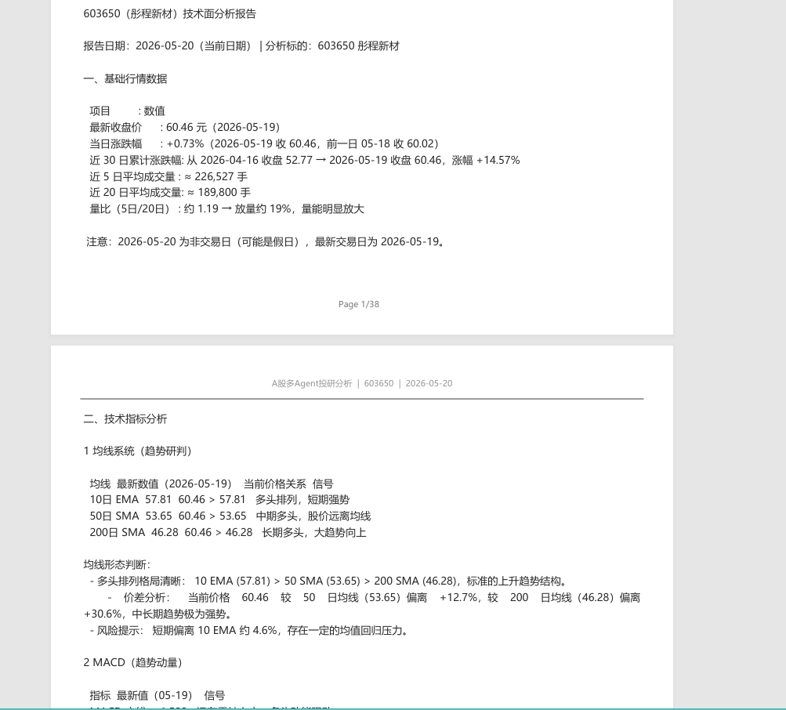
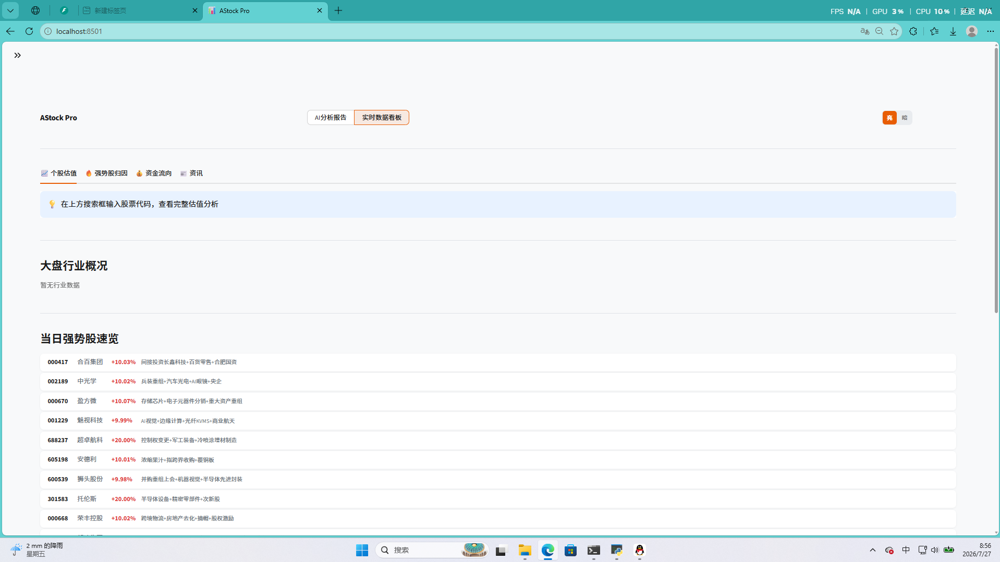
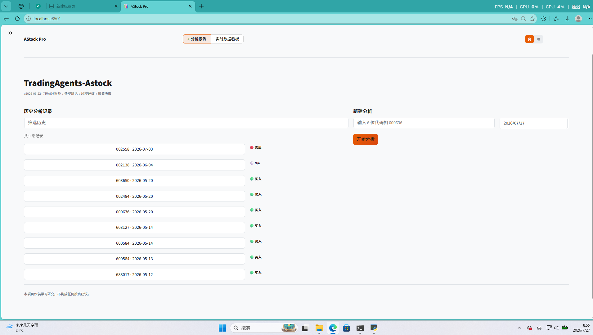
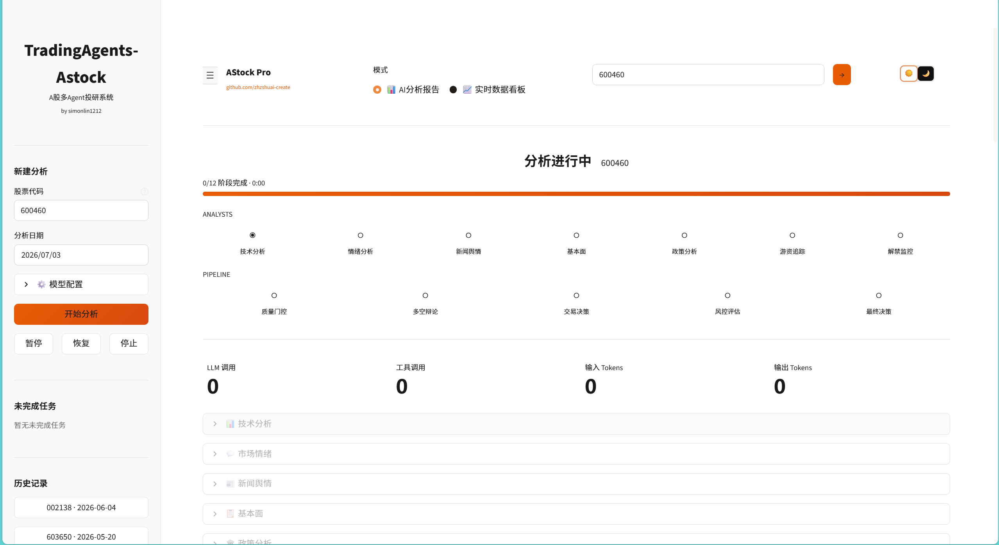
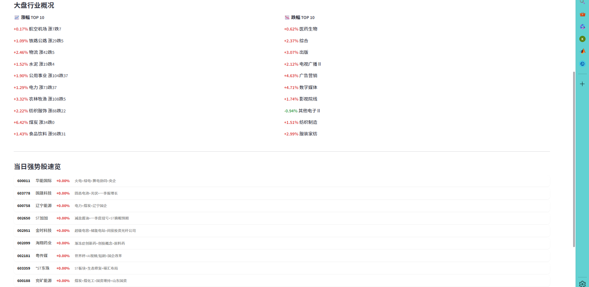
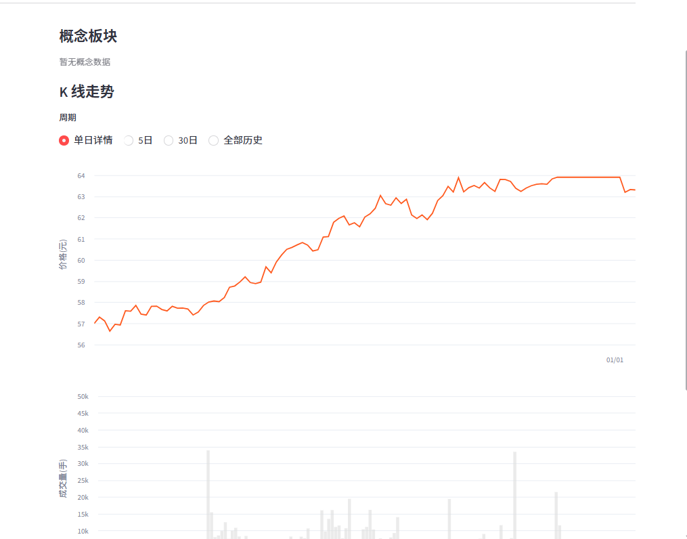

# TradingAgents-Astock

<p align="center">
  =3.10">
  
  
  
  <a href="https://github.com/zhzshuai-create/TradingAgents-Astock/actions/workflows/ci.yml"></a>
  
</p>

AI 多智能体 A 股投资研究平台，集成实时数据看板。基于 [TauricResearch/TradingAgents](https://github.com/TauricResearch/TradingAgents)（65K+ Stars）的深度定制版。

> ⚠️ 仅供学习研究，不构成投资建议。

---

## 📸 界面预览

### AI 分析报告模式

7 个 AI 分析师（可开启并行加速）→ 多空辩论 → 风控评估 → 最终投资决策。

<p align="center">
  
</p>

### 实时数据报告看板

K 线（分时/5日/30日/全部）· 实时估值指标 · 概念板块 · 强势股列表。

<p align="center">
  
</p>

### AI分析报告界面

同一看板在亮色主题下的展示效果。

<p align="center">
  
</p>

### 分析进度

12 阶段 pipeline 实时进度，7 分析师报告可展开查看，支持暂停/继续/停止。

<p align="center">
  
</p>

### 完整报告导出

信号卡片（Buy/Hold/Sell）+ 7 份分析师报告 + 多空辩论 + 风控评估，支持 PDF / Markdown 下载。

<p align="center">
  
</p>

### K 线周期对比

同一股票不同时间周期（分时/5日/30日/全部）的 K 线切换对比。

<p align="center">
  
</p>

---

## 功能特性

| 功能 | 说明 |
|------|------|
| 🧠 **AI 分析报告** | 7 个 AI 分析师 → Bull/Bear 辩论 → 三方风控 → 最终决策，全自动中文研报 |
| 📈 **实时数据看板** | 交互式 K 线图 · 腾讯实时行情 · 北向资金 · 概念板块归因 · 行业对比 |
| 🌓 **即时主题切换** | 亮色 / 暗色一键切换，纯 JS + CSS 零延迟，localStorage 持久化记忆 |
| 📂 **可展开侧边栏** | 顶部 ☰ 按钮控制，内含股票代码输入、LLM 模型配置、历史记录 |
| 🔥 **强势股归因** | 同花顺当日强势股 + 题材标签（AI 算力 / 低空经济 / MLCC…） |
| ⏸️ **分析过程可控** | 随时暂停 / 继续 / 停止，卡死自动检测告警 |
| 📥 **双格式导出** | Markdown（零依赖）和 PDF 中文完整报告，跨平台字体适配 |
| 📝 **历史记录** | 自动保存所有分析，支持代码/日期搜索，一键回溯查看 |
| ⚡ **分析师并行（可选）** | 设 `TA_PARALLEL_ANALYSTS=1` 后 7 个分析师 fan-out 并发执行，墙钟时间约等于最慢的一个 |
| 💾 **断点续跑** | 开启 checkpoint 后分析中途崩溃可从最后完成的节点恢复，配合暂停/停止 |
| 🛡️ **数据层防封** | 东财全端点统一节流 + 失败自动重试；腾讯/新浪/同花顺单发请求也带一次重试 |

---

## 项目结构

```
TradingAgents-Astock/
├── tradingagents/          # 核心框架
│   ├── agents/             # 7 个 AI 分析师 + Bull/Bear 辩论
│   ├── dataflows/          # 数据层（所有行情/财务/新闻接口）
│   │   ├── a_stock/        # A 股数据 vendor（包）
│   │   │   ├── _common.py      # 共享基础设施：代码解析、mootdx 客户端、东财节流、
│   │   │   │                   #   腾讯/同花顺/新浪 helpers、OHLCV 缓存与补数链
│   │   │   ├── quote.py        # K 线行情 + 技术指标
│   │   │   ├── fundamentals.py # 估值快照 + 财报三表 + 盈利预测 + 股东研究
│   │   │   ├── news.py         # 个股新闻 + 全球财经资讯
│   │   │   └── signals.py      # 热股题材 / 北向资金 / 资金流 / 龙虎榜 / 解禁 / 行业对比
│   │   └── interface.py    # vendor 路由模式
│   └── graph/              # LangGraph 分析流程编排（串行链 / 并行 fan-out 可切换）
├── web/                    # Streamlit Web UI
│   ├── app.py              # Web 入口 + AI 分析模式
│   ├── launch.py           # 启动模块（tradingagents-web 命令）
│   ├── data_functions.py   # 看板数据适配层（核心数据层之上的缓存包装）
│   ├── text_utils.py       # 共享文本清洗（think 标签等）
│   ├── runner.py           # 分析运行器（后台线程，支持暂停/继续/停止/断点）
│   ├── components/         # UI 组件
│   │   └── data_dashboard.py   # 实时数据看板渲染
│   └── pdf_export.py       # PDF 导出
├── cli/                    # 命令行工具
│   ├── main.py             # CLI 入口 + 分析编排
│   └── display.py          # 终端显示层（MessageBuffer / 实时布局 / 报告展示）
├── examples/               # 示例脚本
│   └── run_cases.py        # 批量分析样例
├── scripts/                # 工具脚本
├── tests/                  # 测试（164+，含数据解析离线单测与图拓扑测试）
├── .github/workflows/      # CI（ubuntu/windows × py3.10/3.13 测试矩阵）
├── assets/                 # 截图等静态资源
├── issues/                 # Issue 归档记录
├── pyproject.toml          # 项目配置与依赖
└── CHANGELOG.md            # 版本变更日志
```

---

## 快速开始

### 环境要求

- Python >= 3.10
- 无需 Docker（可选）

### 安装

```bash
git clone https://github.com/zhzshuai-create/TradingAgents-Astock.git
cd TradingAgents-Astock
pip install -e .
```

如需使用 Google Gemini 模型（可选）：

```bash
pip install -e ".[google]"
```

### 配置 LLM

创建 `.env` 文件（可参考 `.env.example`）：

```bash
DEEPSEEK_API_KEY=sk-xxx
# 或其他兼容 OpenAI 协议的模型
```

### 启动

**Web 界面（推荐）：**

```bash
streamlit run web/app.py
```

**命令行模式：**

```bash
tradingagents           # 交互式 CLI
tradingagents --help    # 查看所有命令
```

浏览器访问 `http://localhost:8501`。

### 可选：分析师并行加速

默认 7 个分析师按顺序执行。设置环境变量后改为 fan-out 并发（墙钟时间约等于最慢的分析师）：

```bash
# Windows PowerShell
$env:TA_PARALLEL_ANALYSTS = "1"; streamlit run web/app.py

# macOS / Linux
TA_PARALLEL_ANALYSTS=1 streamlit run web/app.py
```

---

## 数据源

mootdx · 腾讯财经 · 东方财富 · 新浪财经 · 同花顺 · 财联社 · 百度股市通

全部免费直连，无需 API Key。

| 来源 | 协议 | 数据类型 |
|------|------|----------|
| mootdx | TCP 7709 | OHLCV K线、财务快照、F10 |
| 腾讯财经 | HTTP | PE/PB/市值/换手率 |
| 东方财富 | HTTP | 龙虎榜、解禁、板块行情、资金流 |
| 新浪财经 | HTTP | K线历史、财报三表 |
| 同花顺 | HTTP | EPS一致预期、热股题材 |
| 财联社 | HTTP | 全球财经快讯 |
| 百度股市通 | HTTP | 概念板块归属 |

---

## 常见问题

### pip install 报 httpx 依赖冲突？

`pip install -e .`（默认安装）不会触发冲突。仅当你额外安装 `[google]` 可选依赖时，mootdx（要求 `httpx<0.26`）与 `langchain-google-genai`（要求 `httpx>=0.28`）互斥。

**解决方案**：
- **推荐**：不用 Google 模型时不装 `[google]`，用 DeepSeek 等国内直连模型即可
- **备选**：手动升级 httpx — mootdx 实际走 TCP 协议，运行时并不调用 httpx（0.11.7 在 httpx 0.28.1 下实测正常）：
  ```bash
  pip install --no-deps httpx>=0.28.1
  ```
- **最稳妥**：用 Google 模型时单独建一个 venv

### 不用 Web 界面怎么批量跑？

使用 `examples/run_cases.py`，支持批量分析多只股票并输出完整报告：

```bash
python examples/run_cases.py
```

每只标的会生成与 CLI 完全一致的 `complete_report.md`（含分析师/研究/交易/风险/组合五个分区 + 合并报告）和 `summary.json`。

### 中文股票名输入支持吗？

支持。输入「贵州茅台」「宁德时代」等中文名称，系统自动解析为 6 位代码。解析失败时请直接输入 6 位数字代码。

### 东财接口被封了怎么办？

v0.2.11 起内置限流机制（请求间隔 ≥ 1s + 随机抖动），且所有东财端点（含看板刷新）都走统一节流入口并带失败自动重试，一般不会触发封禁。如果频繁使用仍被封，可在 `.env` 中增加间隔：

```bash
EM_MIN_INTERVAL=2.0
```

等待几分钟后 IP 会自动解封。

### macOS/Linux 下 PDF 中文不显示？

确保系统安装了中文字体（如 WenQuanYi、Noto Sans CJK）。程序会自动检测可用字体，也可通过环境变量指定：

```bash
FPDF_FONT_PATH=/usr/share/fonts/your-font.ttf
```

---

## 致谢

- [TauricResearch/TradingAgents](https://github.com/TauricResearch/TradingAgents) — 多 Agent 金融交易框架
- [simonlin1212/TradingAgents-astock](https://github.com/simonlin1212/TradingAgents-astock) — A 股数据层与特化分析师角色

## 许可证

Apache 2.0 — 详见 [LICENSE](LICENSE)
